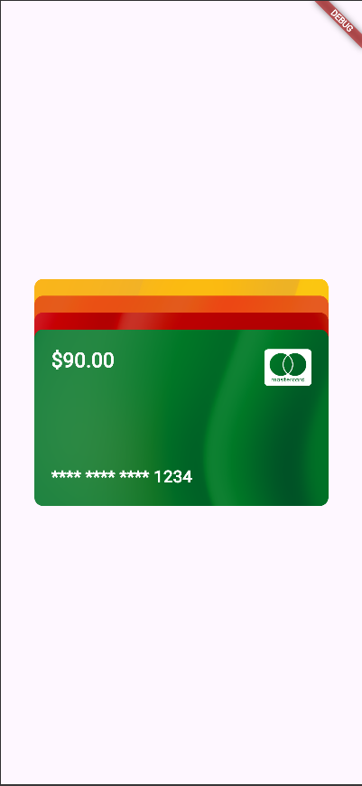
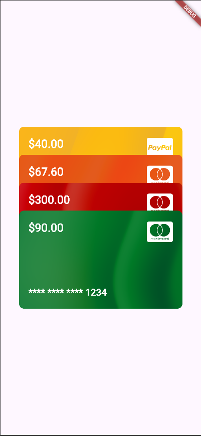

## Stack & Container Demo

Tiny Flutter demo showing how to layer cards with Stack and style them with Container.

### How to run

- Install Flutter and run `flutter pub get`.
- Start the app with `flutter run` (choose any device/emulator).

### Three properties highlighted

1. `Container.decoration` – used to style the card (background image/color and border radius).
2. `Container.width` / `Container.height` – used to control the overall card size.
3. `Positioned.top/left/right/bottom` – used to place icons and text in precise spots inside the Stack.

Other useful attributes like `Stack.alignment`, `Container.padding`, and `Container.margin` exist, but they were not needed for this specific demo UI.

### What I learned

- Use Stack when you want to place widgets on top of each other.
- Use Container when you need a SizedBox with styling (padding, margin, color, borders, shadows, gradients, alignment).
- If all Stack children are `Positioned`, wrap the Stack in a SizedBox/Container to give it height/width or add one non-position SizedBox/Container child to the stack.

### Final UI

#### Screenshots

#### Animation

